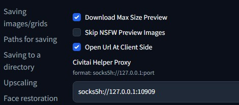

## CivitAI Helper

Stable Diffusion WebUI 扩展CivitAI助手，用于更轻松的管理和使用CivitAI模型。

[CivitAI Url](https://CivitAI.com/models/16768/CivitAI-helper-sd-WebUI-CivitAI-extension)  

## 注意

**本插件需要最新版SD webui，使用前请更新你的SD webui版本。安装本插件后，需要重启SD webui，而不光是重新加载UI，如果碰到问题，先看[常见问题](#常见问题)，并检查命令行窗口的详情。**

## 功能

[中文介绍视频(非官方)](https://youtu.be/x4tPWPmeAgM?t=373)  

* 扫描所有模型，从CivitAI下载模型信息和预览图
* 通过CivitAI模型页面url，连接本地模型和CivitAI模型信息
* 通过CivitAI模型页面url，下载模型(含信息和预览图)到SD目录或子目录。
* 支持aria2下载（断点续传待开发~~~）
* 下载支持断点续传
* 批量检查本地模型，在CivitAI上的新版本
* 直接下载新版本模型到SD模型目录内(含信息和预览图)
* 修改了内置的"Extra Network"模型卡片，每个卡片增加了如下功能按钮:
  * 🌐: 在新标签页打开这个模型的CivitAI页面
  * 💡: 一键添加这个模型的触发词到关键词输入框
  * 🏷: 一键使用这个模型预览图所使用的关键词

## 安装

下载本项目为zip文件，解压到`你的SD WebUI目录/extensions`下即可。

不管是安装还是升级本插件，都要整个关闭SD WebUI，重新启动它。只是Reload UI不起作用。  

(如果用SD WebUI的插件界面安装，请先给git配置代理。它不是通过浏览器下载，是通过git下载。)  

## 使用方法

### 更新你的SD WebUI

请更新SD webui到最新版

### 扫描模型

前往扩展页面"CivitAI Helper"，有个按钮叫："Scan Model"  

点击，就会扫描所有模型，生成SHA256码，用于从CivitAI获取模型信息和预览图。**扫描需要很久，耐心等待**。

每个模型，本扩展都会创建一个json文件，用来保存从CivitAI得到的模型信息。这个文件会保存在模型同目录下，名称为："模型名字.CivitAI.info"。  

如果模型信息文件已经存在，扫描时就会跳过这个模型。如果模型不是CivitAI的，就会创建个空信息文件，以避免以后重复扫描。

#### 添加新模型

当你下载了新模型之后，只要再次点击扫描按钮即可。已经扫描过的文件不会重复扫描，会自动得到新模型的信息和预览图。无须重启SD WebUI。

### 模型卡片

**(先完成扫描，再使用卡片功能)**  
打开SD WebUI's 内置的 "Extra Network" 页面，显示模型卡片  

移动鼠标到模型卡片顶部，就会显示3个额外的按钮：

* 🌐: 在新标签页打开这个模型的CivitAI页面
* 💡: 一键添加这个模型的触发词到关键词输入框
* 🪞: 一键使用这个模型预览图所使用的关键词
  

如果你没有看到这些额外的按钮，只要点击`Refresh CivitAI Helper`，他们就会被重新添加到卡片上。  

每次当Extra Network刷新，他都会删除掉额外的修改，我们的按钮就会消失。这时你就需要点击`Refresh CivitAI Helper`把这些功能添加回去。

### 下载

**(单任务，下载完一个再下另一个)**  
通过CivitAI模型页面Url下载模型，要3个步骤：

* 填入url，点击按钮获取模型信息
* 扩展会自动填入模型名称和类型，你需要选择下载的子目录和模型版本。
* 点击下载  

下载过程会显示在命令行界面带个进度条。  
支持断点续传，无畏大文件。  

### 批量检查模型新版本

你可以按照模型类型，批量检查你的本地模型，在CivitAI上的新版本。你可以选择多个模型类型。  

检查新版本的时候，每检查完一个模型，都会有一个1秒的延迟，所以速度有点慢。

这是为了保护CivitAI避免因为本插件而短暂陷入类似DDos的局面。有些云服务商，有类似“免费用户每秒API请求不能超过1次”的保护机制。CivitAI还没有这种设置。但我们还是得自觉保护它。因为如果它挂了，对大家都没有好处。

**检查完毕之后**，就会如下图，在UI上显示所有找到的新版本的信息。  

每个模型新版本，都有3个链接。

* 第一个是这个模型的网页。
* 第二个是这个新版本的下载地址。
* 第三个是个按钮，在python端，直接下载新版本到模型目录内。  
这种方式下载，下载详情显示在"Download Model"的区域和命令行窗口中。一次一个任务，不支持多任务。  

### 根据URL获取模型信息

如果无法在CivitAI上找到你的模型的SHA256，但你还是希望能把你的模型连接到一个CivitAI模型，你可以在本扩展页面，从列表中选择你的模型，并提供一个CivitAI模型页面的url。

点击按钮之后，扩展就会下载那个CivitAI模型的信息，作为你这个本地模型的信息使用。  

## 设置

现在所有设置被移动到 Setting 页面->Civitai Helper区域中。

代理输入框也在其中。

有些sock5代理, 需要使用socks5h开头的形式"socks5h://xxxxx"才能生效。   

### 预览图

Extra Network支持两种预览图命名：`model_name.png` 和 `model_name.preview.png`。其中，`model_name.png`优先级较高。

当优先级较高的预览图不存在，他就会自动使用`model_name.preview.png`。

这样，你自己创建的预览图 和 网络下载的预览图，能够同时存在，并优先使用你自己创建的。

### 关键词

卡片上，添加关键词按钮，是添加从CivitAI预览图中得到的关键词，而不是你自己创建的图片的关键词。

CivitAI不是每个图片都有关键词，一个模型中，也不是所有预览图关键词都一样。所以这里是遍历所有CivitAI预览图信息，加载第一个有关键词的。

### SHA256

为了创建文件的SHA256，插件需要读取整个文件。对于大尺寸文件，就会很慢。

有两种情况，这个SHA256无法从CivitAI找到对应模型：

* 太老的模型，CivitAI没有存储SHA256.
* 模型作者，静静的换掉了模型文件，但没有修改描述和版本。所以，虽然网页上看不出来，但实际上CivitAI上的 和你本地的模型文件，已经不是同一个文件了。  

这些情况下，你可以在插件上，通过提供模型页面的url，来获取模型信息文件。

### 新特性

从v1.5开始，v1.x不再接受任何新特性。所有新特性进入2.x。

2.x专注于自定义模型信息，并可能改名为"Model Info Helper"。因为不再是专注CivitAI了。

从v1.5开始。v1.x进入维护阶段。  

Enjoy!

### 常见问题

#### 4个卡片按钮不显示

##### 使用了云端汉化功能

如果是秋叶启动器，就关闭启动器“云端汉化”功能。如果是专门的云端汉化插件，就换用普通汉化插件。  

##### 其他情况

首先，确保你点过了"Refresh CivitAI Helper"刷新按钮。  

然后，如果还有这个问题，那么唯一原因，是你没有使用最新版SD WebUI。  

如果你修改过SD WebUI的文件， 你的更新操作可能会失败。你需要检查git命令行的输出信息，来确定你更新成功了。

git在很多时候，会拒绝升级，并告诉你有些冲突需要你手动先解决。如果你不看命令行输出，你就会以为你已经更新成功了，但其实并没有。

#### Request model info from CivitAI

意思就是正在连接CivitAI，如果没有后面的信息，就是连不上，请挂代理。

#### 扫描或获取模型信息失败

这个插件现在很稳定，所以，这个问题的原因，基本是是因为CivitAI拒绝了你的连接请求。  

CivitAI不像那些大网站那么稳定。他网站会挂，会拒绝API连接，还会把API请求转到真人验证页面，来挡住。  

CivitAI还有连接池的设定。基本上，就是同时能允许的最大连接数。一旦达到这个数字，接下来的API连接请求，都会被拒绝。  

所以，这种时候你只能等一下再试。  

另外，对于国内用户，还有代理问题。现在国内都要用代理才能连上。

#### 扫描之后得到了错误的预览图和模型信息

坏消息是，有些模型在CivitAI数据库中，保存的sha256完全是错的。查看下面的issue了解详情：
[https://github.com/CivitAI/CivitAI/issues/426](https://github.com/CivitAI/CivitAI/issues/426)  

对于这种模型，那这个插件自然就无法获得正确的模型信息和预览图。  

这种情况下，请删除扫描得到的模型信息和预览图，在插件界面提供正确的模型url来获取。

另外，CivitAI官方有个页面，专门用于回报带有错误sha256的模型：
[https://discord.com/channels/1037799583784370196/1096271712959615100/1096271712959615100](https://discord.com/channels/1037799583784370196/1096271712959615100/1096271712959615100)  

请把这类模型反馈给CivitAI，好让他们进行修复。  

#### 使用CoLab时扫描失败

首先，在Google中搜索你看到的错误信息。更有可能是，你碰到的是个CoLab的问题。  

然后，如果CoLab连接了Google Drive，会有一次性访问文件数量的限制，而导致扫描失败。这是Google Drive的限制，请自行Google搜索了解详情。
